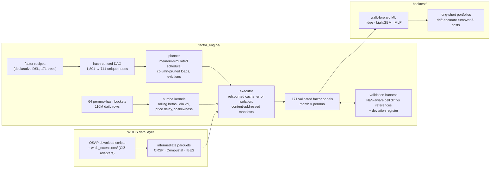

# Quantitative Equity Factor Library & ML Backtesting Platform

A research platform that computes **171 published cross-sectional equity factors**
(the [Open Source Asset Pricing](https://www.openassetpricing.com/) coverage) directly
from raw CRSP / Compustat / IBES data, validates every factor **cell-by-cell against its
reference implementation**, and evaluates them with a walk-forward machine-learning
backtester (ridge / LightGBM / PyTorch MLP) under honest, point-in-time discipline.

- **Universe:** ~40,000 US stocks (CRSP permnos), monthly panels **1926–2025**
- **Correctness:** 171/171 factors reproduce their references exactly at zero tolerance,
  with every intentional deviation documented and statistically proven
- **Scale:** 110M rows of daily data streamed through compiled kernels in a ~20 MB
  working set; full library build ≈ 45 min; incremental rebuilds in minutes

> **No data is included in this repository.** Reproducing results requires a WRDS
> subscription (CRSP, Compustat, IBES). See [Data requirements](#data-requirements--attribution).

---

## Architecture



### Factor engine (`factor_engine/`)

| Component | What it does |
| --- | --- |
| `p1_factor_specs.py` | Every factor written as a declarative **expression tree** (a small DSL: load column → lag → arithmetic → universe masks), so recipes are inspectable data, not opaque code |
| `p1_factor_engine.py` | ~300 registered operators: aligned month×permno panel algebra, universe/fill semantics replicating the reference scripts, and self-contained signal kernels with hand-audited data footprints |
| `p1_factor_dag.py` | Bottom-up Merkle **hash-consing** merges the 171 trees (1,801 node instances) into 741 unique computations — shared work is computed once. No algebraic rewrites: float op order is preserved so outputs stay bit-comparable |
| `p1_planner.py` | Compiles the DAG into an explicit plan: dataset-affinity factor ordering, per-file **column-pruned loads** resolved against on-disk schemas, eviction at last use, refcounts for freeing, and a **static memory simulation** that predicts peak RAM and refuses over-budget plans |
| `p1_executor.py` | Replays the plan: value cache freed by refcount, per-factor error isolation (a failing node poisons only its consumers), and **content-addressed manifests** (recipe Merkle root ⊕ input-file fingerprints ⊕ kernel versions) so unchanged factors are skipped on rebuild |
| `p1_daily_kernels.py` + `p1_kern_*.py` | Daily-data factors stream **64 permno-hash buckets (~20 MB each)** of the 110M-row daily file through `@numba.njit` kernels — rolling regressions, within-month moments, 52-week highs — instead of materializing ~8 GB/variable wide pivots |
| `p1_validation.py` | The golden/oracle harness: NaN-aware, inf-aware cell-by-cell comparison of every factor against its reference output, with per-factor reports |
| `p1_refresh_gate.py`, `p1_refresh_factor_gate.py` | Data-refresh gates: quantify vendor restatements file-by-file and classify every factor change as identical / restated / suspect before a new vintage is accepted |
| `p1_deviation_register.md` | The ledger: every deliberate difference from a reference implementation, with mechanism, measured cell counts, and sampled proof |

### Backtester (`backtest/`)

Rolling-window cross-sectional stock selection (`Quant_Strategy_ML`): 10-year training
windows retrained annually, IC/IR-based factor selection, market-demeaned labels,
per-date cross-sectional rank features, pluggable models behind one `fit`/`predict`
interface (closed-form ridge, LightGBM, PyTorch MLP with early stopping), long-short
portfolio construction with partial-exchange rules, and a numba backtest kernel with
**drift-accurate turnover** and held-through accounting for unrebalanced periods.
A 30-test suite covers the timing conventions, gap accounting, and preprocessing
train/test separation.

---

## The correctness program

Backtests are only as honest as their inputs, so correctness is treated as a program,
not an afterthought:

1. **Reference parity first.** Every factor's engine output is diffed cell-by-cell
   (~4.6M cells per factor) against the output of its reference script. Pass requires
   identical NaN patterns — a value where the reference has "missing" is a failure —
   and exact agreement on jointly-valued cells.
2. **Deviate only with proof.** References are academic code and are sometimes wrong.
   Each intentional deviation (look-ahead removal, NaN discipline, translation-artifact
   fixes) enters the register only after a sampled mechanism check explains **every**
   differing cell.
3. **Point-in-time everywhere.** Examples: the Pástor–Stambaugh liquidity series is
   re-estimated point-in-time (expanding window, values frozen once computed) instead of
   using the published look-ahead series; annual factor values fill a fixed 12-month
   horizon rather than "until the next stamp" (which encodes future information).

### Findings worth reading (the honest-results section)

- **A support-only look-ahead can be worth 11 points of Sharpe-adjusted return.** The
  reference construction of the price-delay factors leaves a stock's value *missing in
  the months just before it delists* (because no later annual stamp exists). After
  median-fill and cross-sectional ranking, that missingness becomes an exact `0.0` —
  an ex-post "will delist" flag a gradient-boosted tree happily learns. Controlled
  vintage comparisons attributed **~78% of the tree model's apparent alpha** to exactly
  those stocks (long-short 34% → 23%/yr once fixed).
- **The rest of the nonlinear "edge" lived in untradeable microcaps.** Unscreened books
  held names with median price $2–3 and median cap $25–50M; single positions returning
  10–20× drove headline years. With a standard $5 minimum-price screen, the tree
  model's edge is statistically indistinguishable from zero, and the MLP retains a
  modest market-neutral alpha (≈+6%/yr, t≈1.9, β≈−0.07) that still does not beat the
  S&P 500 risk-adjusted.
- **Return panels without delisting returns flatter everything.** A compounded-daily
  return panel missing CRSP delisting returns overstated final-month returns of
  delisted stocks by **+11pp on average** — precisely the names short legs live in.
- **Training on raw returns teaches market timing, not stock selection.** Switching to
  market-demeaned labels and per-date rank features flipped out-of-sample rank IC from
  −0.03 to +0.03 with the identical model.

---

## Repository layout

```
factor_engine/          the engine: DSL, DAG, planner, executor, kernels, validation
factor_engine/audits/   machine-readable audit artifacts (footprints, rulings, look-ahead audit)
wrds_extensions/        CRSP CIZ-format adapters extending the OSAP download pipeline
backtest/               Quant_Strategy_ML walk-forward backtester + models + 30-test suite
```

## Data requirements & attribution

- **Data:** CRSP, Compustat, and IBES via a [WRDS](https://wrds-www.wharton.upenn.edu/)
  subscription. Nothing in this repository contains or reproduces that data, and none of
  it may be redistributed. Credentials live in a local `.env` (git-ignored).
- **Factor definitions:** [Open Source Asset Pricing](https://www.openassetpricing.com/)
  — Chen, Andrew Y. and Tom Zimmermann, "Open Source Cross-Sectional Asset Pricing,"
  *Critical Finance Review* (2022). Their download pipeline is a runtime dependency for
  raw data preparation and is **not** vendored here; the factor implementations in this
  repository are independent reimplementations validated against their outputs.
- **License:** MIT for the code in this repository (see `LICENSE`).

*Built with AI-assisted development (LLM agent orchestration for implementation,
adversarial code audits, and data forensics), with all results gated through the
validation harness described above.*
